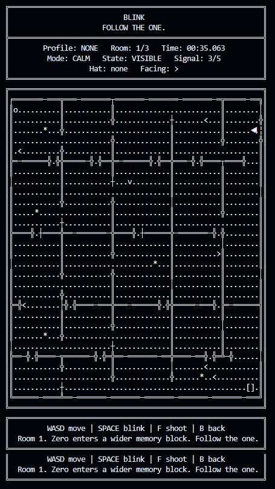

# BLINK

```text
██████╗  ██╗     ██╗ ███╗   ██╗ ██╗  ██╗
██╔══██╗ ██║     ██║ ████╗  ██║ ██║ ██╔╝
██████╔╝ ██║     ██║ ██╔██╗ ██║ █████╔╝
██╔══██╗ ██║     ██║ ██║╚██╗██║ ██╔═██╗
██████╔╝ ███████╗██║ ██║ ╚████║ ██║  ██╗
╚═════╝  ╚══════╝╚═╝ ╚═╝  ╚═══╝ ╚═╝  ╚═╝
```

**BLINK** is a real-time terminal stealth game written in C.

You play as **Zero**, a small digital survivor moving through a hostile system. Move fast, hide your signal, follow the one, and escape before the system deletes you.

<p align="left">
  
</p>

---

## The Legend

According to the rumors, **BLINK** began as an obscure 1980s assembly terminal game. Programmers would play it during breaks, competing from their workstations to see who could finish the fastest.

Nobody knows exactly who wrote the original version. Some say it was passed around on copied disks. Others say it lived only inside office machines, rewritten and modified by every programmer who touched it.

This project is a modern recreation of that lost classic, built as a C practice project by a programming student who loves old games, terminals, and strange digital legends.

---

## Controls

```text
W A S D  Move
SPACE    Blink
F        Shoot
B        Back / abandon run
Q        Quit from the main menu
```
---

## Requirements

You need a C compiler and a terminal with UTF-8 support.

The game uses Unicode symbols and ANSI terminal escape codes. A modern terminal is recommended.

---

## Build and Run

Clone the repository:

```bash
git clone https://github.com/luisfim/blink.git
cd blink
```

### Linux

Install GCC if needed:

```bash
sudo apt update
sudo apt install gcc -y
```

Compile:

```bash
gcc -Wall -Wextra -std=c11 blink.c -o blink
```

Run:

```bash
./blink
```

### macOS

Install the Apple command line tools if needed:

```bash
xcode-select --install
```

Compile:

```bash
clang -Wall -Wextra -std=c11 blink.c -o blink
```

Run:

```bash
./blink
```

### Windows

The portable version of BLINK supports native Windows builds through MinGW-w64/MSYS2.

Install MSYS2, open the **MSYS2 MinGW 64-bit** terminal, then install GCC:

```bash
pacman -Syu
pacman -S mingw-w64-x86_64-gcc
```

Clone and compile:

```bash
git clone https://github.com/luisfim/blink.git
cd blink
gcc -Wall -Wextra -std=c11 blink.c -o blink.exe
```

Run:

```bash
./blink.exe
```

### Windows through WSL

You can also run the Linux version on Windows using WSL:

```powershell
wsl --install
```

Then, inside Ubuntu/WSL:

```bash
sudo apt update
sudo apt install gcc git -y
git clone https://github.com/luisfim/blink.git
cd blink
gcc -Wall -Wextra -std=c11 blink.c -o blink
./blink
```

---

## Troubleshooting

### The screen looks broken or scrolls constantly

Make the terminal bigger or zoom out.

### Symbols look wrong

Use a terminal with UTF-8 support.

Recommended terminals:

```text
Linux: GNOME Terminal, Konsole, xterm, Alacritty
macOS: Terminal.app, iTerm2
Windows: Windows Terminal
```
